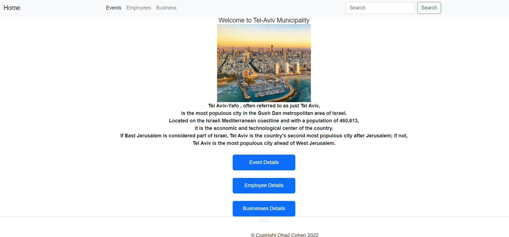
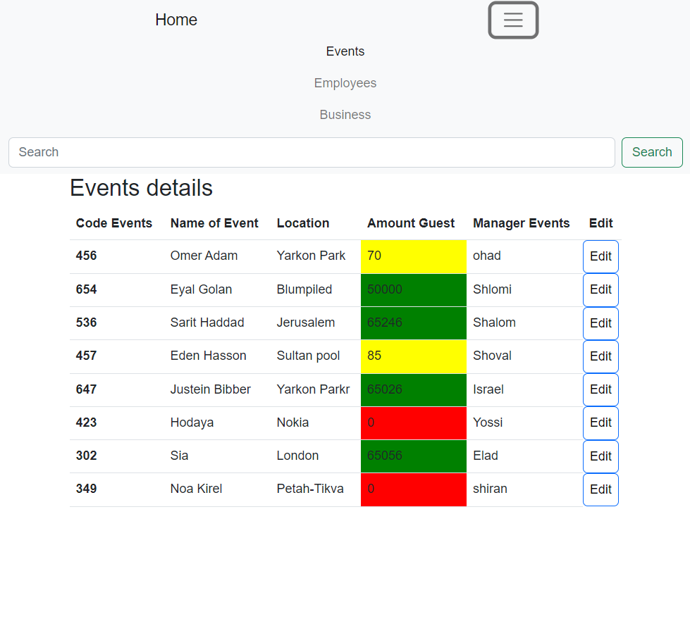
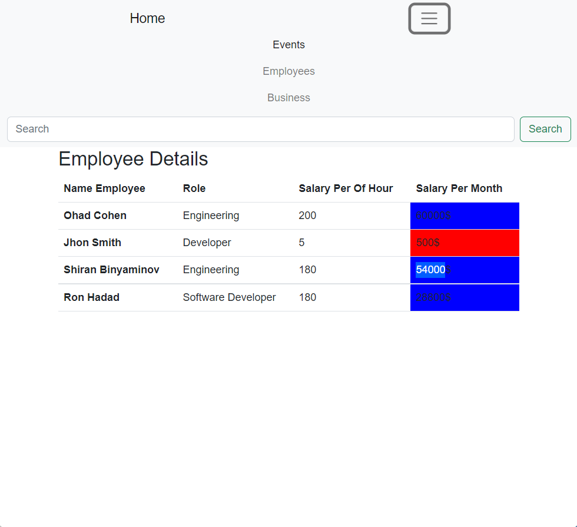
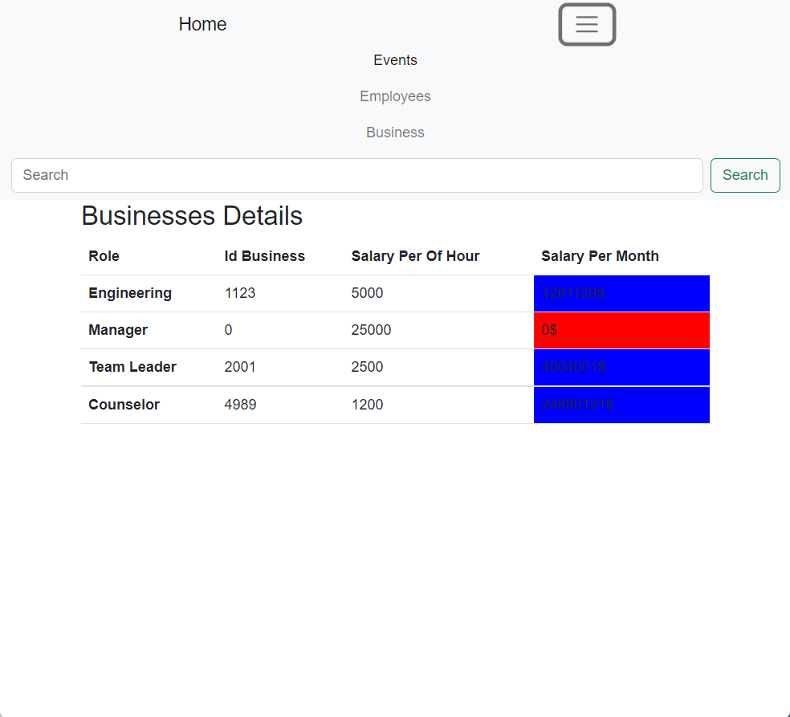

# Finally Project Angular

## Municipality
I created a municipality website, the site contains details about the municipality:
Employees, residents, businesses, events, etc ..

##### Events Module
Contains a table showing the events of the municipality when if the number of people in the event is greater than 30 but less than 100 it will be marked in yellow, otherwise if the number of people is less than 30 it will be marked in red
Otherwise - it will be marked in green, it is also possible to click on the edit button and reach a new page that will allow me to edit the same specific event, any information details that are changed will be updated automatically

##### Employee Module

I created a employee class that has 4 employee objects in it.
I created a component that will show me in the table the set of employees and their details.
The table also shows a calculation of the monthly salary for each employee,
If the employee's monthly hair is less than 3000 the line will be marked in red, otherwise it will be marked in blue.

##### Businesses Module

I created a business department
Which shows me in the table all the details of the aches,
If the average monthly profit is less than 5000, we will mark the line of the business in red, otherwise it will be marked in blue

##### I hope you enjoyed,
#### Thank you very much Ohad.